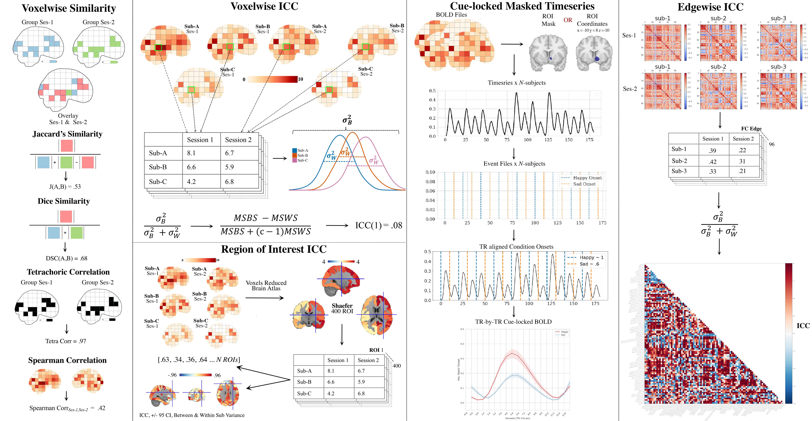

# PyReliMRI: Python-based Reliability in MRI

## Introduction

PyReliMRI provides multiple reliability metrics for task fMRI and resting state fMRI data, essential \
for assessing the consistency and reproducibility of MRI-based research. The package is described and used in the [Preprint](https://www.doi.org/10.1101/2024.03.19.585755)

## Authors

- [Michael I. Demidenko](https://orcid.org/0000-0001-9270-0124)
- [Jeanette A. Mumford](https://orcid.org/0000-0002-0926-3531)
- [Russell A. Poldrack](https://orcid.org/0000-0001-6755-0259)

### Citation

If you use PyReliMRI in your research, please cite it using the following DOI:

Demidenko, M., Mumford, J., & Poldrack, R. (2024). PyReliMRI: An Open-source Python tool for Estimates of Reliability \
in MRI Data (2.1.0) [Computer software]. Zenodo. https://doi.org/10.5281/zenodo.12522260

## Purpose

Reliability questions for [task fMRI](https://www.doi.org/10.1177/0956797620916786) and [resting state fMRI](https://www.doi.org/10.1016/j.neuroimage.2019.116157) are increasing. As described in [2010](https://www.doi.org/10.1111/j.1749-6632.2010.05446.x), there are various ways that researchers calculate reliability. Few open-source packages exist to calculate multiple individual and group reliability metrics using one tool.
 PyReliMRI offers comprehensive tools for calculating reliability metrics in MRI data at both individual and group levels. It supports various MRI analysis scenarios including multi-run and multi-session studies.

### Features

- **Group Level:**
  - `similarity.py`: Calculates similarity coefficients between fMRI images.
  - `icc.py`: Computes Intraclass Correlation Coefficients (ICC) across subjects.

- **Individual Level:**
  - `brain_icc.py`: Computes voxel-wise (can parallelize w/ `n_jobs`) and atlas-based ICC.
  - `conn_icc.py`: Estimates ICC for precomputed correlation matrices.

- **Utility:**
  - `masked_timeseries.py`: Extracts and processes timeseries data from ROI masks or coordinates.

## Scripts Overview

| **Script Name**                    | **Functions**                                          | **Inputs**                                                                                                                                                                                          | **Purpose**                                                                                                                                                               |
|:-----------------------------------|:-------------------------------------------------------|:---------------------------------------------------------------------------------------------------------------------------------------------------------------------------------------------------|:--------------------------------------------------------------------------------------------------------------------------------------------------------------------------|
| [brain_icc.py](/pyrelimri/brain_icc.py) | voxelwise_icc, roi_icc                                 | See detailed descriptions for required and optional inputs.                                                                                                                                                                                                                                                                                                | Calculates intraclass correlation (ICC) metrics for voxel-wise and ROI-based data, supporting various ICC types and outputs.                                             |
| [icc.py](/pyrelimri/icc.py)         | sumsq_total, sumsq, sumsq_btwn, icc_confint, sumsq_icc | Panda long dataframe with subject, session, scores, and ICC type inputs required.                                                                                                                                                                                  | Computes sum of squares and ICC estimates with confidence intervals, useful for assessing reliability across measurements.                                                 |
| [similarity.py](/pyrelimri/similarity.py) | image_similarity, pairwise_similarity                  | Input paths for Nifti images and optional parameters for image similarity calculations.                                                                                                                                                                           | Computes similarity coefficients between fMRI images, facilitating pairwise comparisons and similarity type selection.                                                    |
| [conn_icc.py](/pyrelimri/conn_icc.py) | triang_to_fullmat, edgewise_icc                        | List of paths to precomputed correlation matrices as required inputs.                                                                                                                                                                                             | Calculates ICC for edge-wise correlations in precomputed matrices, enhancing reliability assessment in connectivity studies.                                               |
| [masked_timeseries.py](/pyrelimri/masked_timeseries.py) | extract_time_series, extract_postcue_trs_for_conditions | Detailed inputs required for various functions: extract_time_series, extract_postcue_trs_for_conditions, etc.                                                                                                                                                      | Extracts and processes timeseries data from BOLD images, supporting ROI-based analysis and event-locked responses for functional MRI studies.                           |

## Conclusion

PyReliMRI simplifies the calculation of reliability metrics for MRI data, supporting both research and clinical applications. For detailed usage instructions, visit the [documentation](https://pyrelimri.readthedocs.io/en/latest/).
