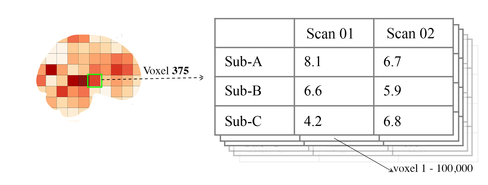
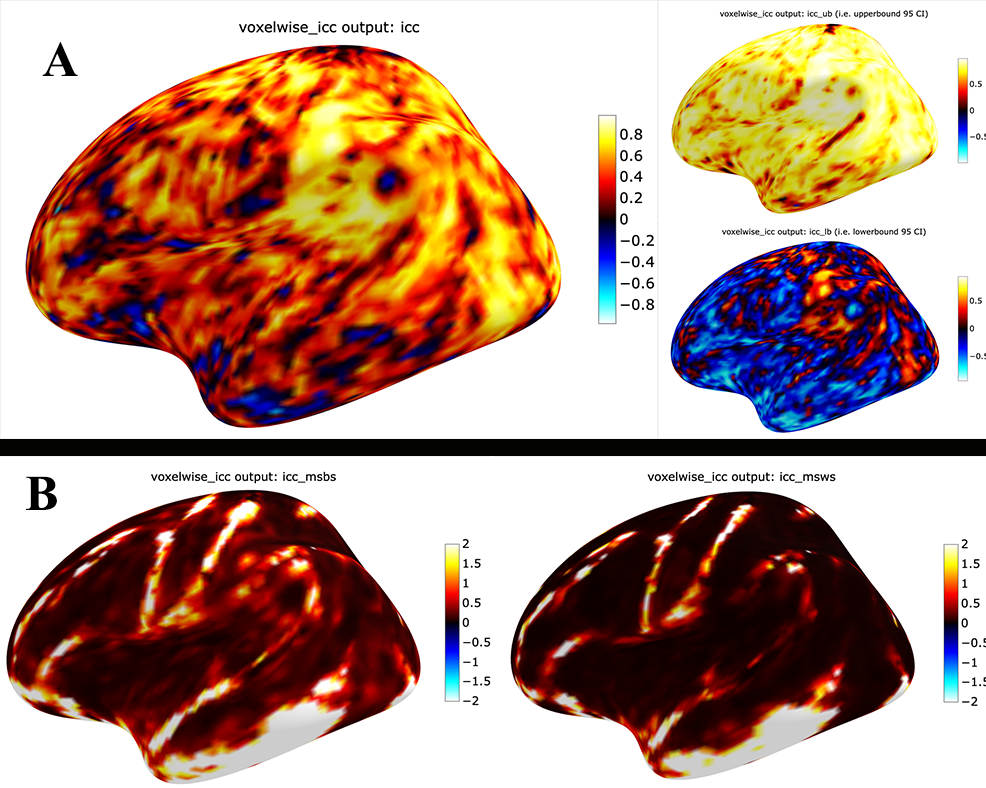

Intraclass Correlation Functions
================================

The intraclass correlation (ICC) estimates are a complement to the similarity functions. The variability/similarity \
in the data can be parsed in several ways. One can estimate home similar things are about a threshold (e.g., 1/0) or \
how similarity specific continuous estimates are across subjects. The ICC is used for the latter here.

Two components are described with some examples: The  `icc` and `brain_icc` modules. The first is the manual estimation \
of the components of the ICC, such the the sum of (1) squared total,  the sum of (2) squared within, (3) sum of squared between \
their associated mean sums of squared (which is 1-3 divided by the degrees of freedom) in `icc` module. Then, the next step is to \
calculate these values on a voxel-by-voxel basis (or if you wanted to, ROI by ROI) using `brain` module.

icc
---

While `icc` is within the package for MRI reliability, it can still be used to calculate different values on dataframes. \
Below will describe the different components and use `seaborns.anagrams <https://github.com/mwaskom/seaborn-data/blob/master/anagrams.csv>`_ \
as the example for each of these.

The first 5-rows of the anagrams data are:

+--------+---------+-----+-----+-----+
| subidr |  attnr  | num1| num2| num3|
+========+=========+=====+=====+=====+
|    1   | divided |  2  |  4  |  7  |
+--------+---------+-----+-----+-----+
|    2   | divided |  3  |  4  |  5  |
+--------+---------+-----+-----+-----+
|    3   | divided |  3  |  5  |  6  |
+--------+---------+-----+-----+-----+
|    4   | divided |  5  |  7  |  5  |
+--------+---------+-----+-----+-----+
|    5   | divided |  4  |  5  |  8  |
+--------+---------+-----+-----+-----+

We can load the example data, filter to only use the `divided` values and convert the data into a long data format:

.. code-block:: python

    import seaborn as sns
    data = sns.load_dataset('anagrams') # load
    a_wd = data[data['attnr'] == 'divided'] # filter
    # convert to wide, so the subject/id variables are still `subidr` and values were stacking from `num1`,`num2`,num3`
    # the values will be stored in the column `vals` and the session labels (from num1-num3) into `sess`
    long_df = pd.DataFrame(
        pd.melt(a_wd,
               id_vars="subidr",
               value_vars=["num1", "num2", "num3"],
               var_name="sess",
               value_name="vals"))

**sumsq_total**

The sum of squared total is the estimate of the total variance across all subjects and measurement occasions. Expressed \
the formula used is:

.. math::

    \text{sumsq_total}(df_{long}, values) = \sum_{i=1}^{n}(x_i - \bar{x})^2

where:
    * df_long = pandas DataFrame (df) in long format \
    * values = is a variable string for the values containing the scores in df \
    * x_i = is each value in the column specified by values column in df \
    * x_bar = is the global mean specified by 'values' column in df

Using the anagrams `long_df` we can calculate the sum of square total using:

.. code-block:: python

    from pyrelimri import icc
    icc.sumsq_total(df_long=long_df, values="vals")

We will get the result of 71.8 sum of squared `total`.

**sumsq_within**

.. math::

    \text{sumsq_within}(df_{long}, sessions, values, n_{subjects}) = n_{subjects} \sum_{i=1}^m (\overline{x}_i - \overline{x})^2

where:
    * df_long = pandas DataFrame in long format \
    * sessions = is a session (repeated measurement) variable, string, in df \
    * values = is a variable, string, for the values containing the scores in df \
    * n_subjects = the number of subjects in df \
    * x_i_bar = is the mean of the `values` column for session `i` in df \
    * x_bar = is the global mean specified by 'values' column in df
    * m = is the number of sessions

We can calculate the sum of squares within using the below:

.. code-block:: python

    # if you havent imported the package already
    from pyrelimri import icc
    icc.sumsq_within(df_long=a_ld,sessions="sess", values="vals", n_subjects=10)

We will get the result of 29.2 sum of squares `between` subject factor.

**sumsq_btwn**

.. math::

    \text{sumsq_btwn}(df_{long}, subj, values, n_{sessions}) = n_{sessions} \sum_{i=1}^s (\overline{x}_i - \overline{x})^2

where:
    * df_long = pandas DataFrame in long format \
    * subj = is the subject variable, string, in df \
    * values = is a variable, string, for the values containing the scores in df \
    * n_sessions = the number of sessions in df \
    * x_i_bar = is the mean of the `values` column for subject `i` in df \
    * x_bar = is the global mean specified by 'values' column in df
    * s = is the number of subjects

.. code-block:: python

    # if you havent imported the package already
    from pyrelimri import icc
    icc.sumsq_btwn(df_long=a_ld,subj="subidr", values="vals", n_sessions=3) # 3 = num1-num3

We will get the result of 20.0 sum of squares `between` subject factor.

Note: If you recall that ICC is the decomposition of `total` variance, you'll notice that 29.2 + 20.0 \
do not sum to the total variance, 71.8. This is because there is the subj*sess variance component \
and the residual variance, too. You can review this in an anova table:

+---------------+-----------+----+-----------+-----+
|     Source    |     SS    | DF |     MS    | np2 |
+===============+===========+====+===========+=====+
|     subidr    | 20.008333 |  9 | 2.223148  | 1.0 |
+---------------+-----------+----+-----------+-----+
|      sess     | 29.216667 |  2 | 14.608333 | 1.0 |
+---------------+-----------+----+-----------+-----+
| subidr * sess | 22.616667 | 18 | 1.256481  | 1.0 |
+---------------+-----------+----+-----------+-----+
|    Residual   |   0.000000|  0 |    -      | -   |
+---------------+-----------+----+-----------+-----+

**icc_confint**

For each ICC estimate that can be requested, ICC(1), ICC(2,1) and ICC(3,1) and confidence interval \
is returned with each ICC estimate. The implementation for the confident interval is the same as in \
the the `pingouin <https://github.com/raphaelvallat/pingouin/blob/master/pingouin/reliability.py>`_ \
package in Python and the `ICC() from psych <https://search.r-project.org/CRAN/refmans/psych/html/ICC.html>`_ \
package in R.

**sumsq_icc**

Now that the internal calculations of the ICC have been reviewed, we can use the package to get the values of interest. \
The associated formulas for the ICC(1), ICC(2,1) and ICC(3,1) are described below.

.. math:: \text{ICC(1)} = \frac{MS_Btwn - MS_Wthn}{MS_Btwn + (sess - 1) MS_Wthn}

.. math:: \text{ICC(2,1)} = \frac{MS_Btwn - MS_Err}{MS_Btwn + (sess - 1) * MS_Err + sessions * (MS_sess - MS_Err) / N_subjs}

.. math:: \text{ICC(3,1)} = \frac{MS_Btwn - MS_Err}{MS_Btwn + (sess - 1) * MS_Err}

Where:

- MS_Btwn: mean square between subjects
- MS_Wthn: mean square within subjects
- MS_Err: mean squared residual error
- MS_Sess: mean squared error of sessions
- Sess: is the number of sessions
- N_subjs: numbers of subjects

Hence, `sumsq_icc` can be used on a dataset with multiple subjects with 1+ measurement occasions. The ICC can be calculated \
for the anagrams data references above.
Note: the required inputs are a long dataframe, subject variable, \
session variable and the value scores variables that are contained in the long dataframe, plus the \
icc to return (options: icc_1, icc_2, icc_3; default: icc_3).

The `sumsq_icc` function will return five values: the ICC estimate, lower bound 95% confidence interval, \
upper bound 95% confidence interval, mean square between subject variance, mean square within subject variance. \
This information will print to a terminal or can be saved to five variables. Example:

.. code-block:: python

    # if you havent imported the package already
    from pyrelimri import icc

    icc3, icc3_lb, icc3_up, icc3_msbs, icc3_msws = icc.sumsq_icc(df_long=a_ld,sub_var="subidr",
                                                    sess_var="sess",value_var="vals",icc_type="icc_3")

This will store the five associated values in the five variables:
    - `icc3`: ICC estimate
    - `icc3_lb`: 95% lower bound CI for ICC estimate
    - `icc3_lb`: 95% upper bound CI for ICC estimate
    - `icc3_msbs`: Mean Squared Between Subject Variance using for ICC estimate
    - `icc3_msws`: Mean Squared Within Subject Variance used for ICC estimate

Reminder: If NaN/missing values, use mean replacement of all column values. If this is not prefer, handle missing/unbalanced \
cases before hand.

brain_icc
---------

The `brain_icc` module is, for a lack for better words, a big wrapper for for the `icc` module. \
In short, the `voxelwise_icc` function within the `brain_icc` modules calculates the ICC for 3D nifti brain images \
across subjects and sessions on a voxel-by-voxel basis. Here are the steps it uses:

    - Function takes a list of paths to the 3D nifti brain images for each session, the path to the nifti mask object, and the ICC type to be calculated.
    - Function checks if there are the same number of files in each session (e.g., list[0], list[1], etc) and raises an error if they are of different length.
    - Function concatenates the 3D images into a 4D nifti image (4th dimension is subjects) using image.concat_imgs().
    - Function uses the provided nifti mask to mask the images using NiftiMasker.
    - Function loops over the voxels in the `imgdata[0].shape[-1]` and creates a pandas DataFrame with the voxel values for each subject and session using sumsq_icc().
    - The function calculates and returns a dictionary with five 3D volumes: est, lower (lower_bound) and upper (upper_bound) of the ICC 95% confidence interval, mean square between subjects (ms_btwn), and mean square within subjects (ms_wthn) using sumsq_icc().
    - Note, the shape of the provided 3D volume is determined using inverse_transform from NiftiMasker.

**voxelwise_icc**

As mentioned above, the `voxelwise_icc` calculates the ICC values for value in the 3D volumes. \
If we thing of an image as having the dimensions of [45, 45, 90], we can unravel it into a single vector \
for each subject that is 182,250 values long (the length in the voxelwise case is the number of voxels). \
The `voxelwise_icc` returns an equal size in length array that contains the ICC estimate for each voxels, \
between subjects across the measurement occasions. For example:

To use the `voxelwise_icc` function you have to provide the following information:
    - multisession_list: A list of listed paths to the Nifti z-stat, t-stat or beta maps for sess1, 2, 3, etc (or run 1,2,3..)
    - mask: The Nifti binarized masks that will be used to mask the 3D volumes.
    - icc_type: The ICC estimate that will be calculated for each voxel. Options: `icc_1`, `icc_2`, `icc_3`. Default: `icc_3`

The function returns a dictionary with 3D volumes for:
    - ICC estimates
    - ICC lowerbound 95% CI
    - ICC upperbound 95% CI
    - Mean Squared Between Subject Variance
    - Mean Squared Within Subject Variance

Say we have stored paths to session 1 and session 2 in the following variables (Note: subjects in list have same order!):

.. code-block:: python

    # session 1 paths
    scan1 = ["./scan1/sub-1_t-stat.nii.gz", "./scan1/sub-2_t-stat.nii.gz", "./scan1/sub-3_t-stat.nii.gz", "./scan1/sub-4_t-stat.nii.gz", "./scan1/sub-5_t-stat.nii.gz",
             "./scan1/sub-6_t-stat.nii.gz", "./scan1/sub-7_t-stat.nii.gz", "./scan1/sub-8_t-stat.nii.gz"]
    scan2 = ["./scan2/sub-1_t-stat.nii.gz", "./scan2/sub-2_t-stat.nii.gz", "./scan2/sub-3_t-stat.nii.gz", "./scan2/sub-4_t-stat.nii.gz", "./scan2/sub-5_t-stat.nii.gz",
             "./scan2/sub-6_t-stat.nii.gz", "./scan2/sub-7_t-stat.nii.gz", "./scan2/sub-8_t-stat.nii.gz"]

Next, you can call these images paths in the function and save the 3d volumes using:

.. code-block:: python

    from pyrelimri import brain_icc

    brain_icc_dict = brain_icc.voxelwise_icc(multisession_list = [scan1, scan2], mask = "./mask/brain_mask.nii.gz", icc_type = "icc_3")

This will return the associated dictionary with nifti 3D volumes which can be manipulated further.

Here we plot the icc estimates (i.e. 'est') using nilearn's plotting

.. code-block:: python

    from nilearn.plotting import view_img_on_surf

    view_img_on_surf(stat_map_img = brain_icc["est"],
                     surf_mesh = 'fsaverage5', threshold = 0,
                     title_fontsize = 16, colorbar_height = .75,
                     colorbar_fontsize = 14).open_in_browser()

Here we save using nibabel:

.. code-block:: python

    import nibabel as nib
        nib.save(icc_3d, os.path.join('output_dir', 'file_name.nii.gz'))

Here is a real-world example using neurovaults data collection for Precision Functional Mapping of Individual brains. The \
collection is: `2447 <https://neurovault.org/collections/2447/>`_. The neurovault collection provides data for ten subjects, with \
ten sessions. We will use the first two sessions. We will use the block-design motor task and focus on the [Left] Hand univariate \
beta maps which are listed under "other".

Let's use nilearn to load these data for 10 subjects and 2 sessions.

.. code-block:: python

    from nilearn.datasets import fetch_neurovault_ids
    # Fetch left hand motor IDs
    MSC01_ses1 = fetch_neurovault_ids(image_ids=[48068]) # MSC01 motor session1 1 L Hand beta
    MSC01_ses2 = fetch_neurovault_ids(image_ids=[48073]) # MSC01 motor session2 1 L Hand beta
    MSC02_ses1 = fetch_neurovault_ids(image_ids=[48118])
    MSC02_ses2 = fetch_neurovault_ids(image_ids=[48123])
    MSC03_ses1 = fetch_neurovault_ids(image_ids=[48168])
    MSC03_ses2 = fetch_neurovault_ids(image_ids=[48173])
    MSC04_ses1 = fetch_neurovault_ids(image_ids=[48218])
    MSC04_ses2 = fetch_neurovault_ids(image_ids=[48223])
    MSC05_ses1 = fetch_neurovault_ids(image_ids=[48268])
    MSC05_ses2 = fetch_neurovault_ids(image_ids=[48273])
    MSC06_ses1 = fetch_neurovault_ids(image_ids=[48318])
    MSC06_ses2 = fetch_neurovault_ids(image_ids=[48323])
    MSC07_ses1 = fetch_neurovault_ids(image_ids=[48368])
    MSC07_ses2 = fetch_neurovault_ids(image_ids=[48368])
    MSC08_ses1 = fetch_neurovault_ids(image_ids=[48418])
    MSC08_ses2 = fetch_neurovault_ids(image_ids=[48423])
    MSC09_ses1 = fetch_neurovault_ids(image_ids=[48468])
    MSC09_ses2 = fetch_neurovault_ids(image_ids=[48473])
    MSC10_ses1 = fetch_neurovault_ids(image_ids=[48518])
    MSC10_ses2 = fetch_neurovault_ids(image_ids=[48523])

Now that our data is loaded, we specify the session paths (recall, Nilearn saves the paths to the images on your computer) \
and then we will provide this information to `voxelwise_icc` within `brain`

.. code-block:: python

    # session 1 list from MSC
    sess1_paths = [MSC01_ses1.images[0], MSC02_ses1.images[0], MSC03_ses1.images[0],
                   MSC04_ses1.images[0], MSC05_ses1.images[0], MSC06_ses1.images[0],
                   MSC07_ses1.images[0], MSC08_ses1.images[0],MSC09_ses1.images[0],
                   MSC10_ses1.images[0]]
    # session 2 list form MSC
    sess2_paths = [MSC01_ses2.images[0], MSC02_ses2.images[0], MSC03_ses2.images[0],
                   MSC04_ses2.images[0], MSC05_ses2.images[0], MSC06_ses2.images[0],
                   MSC07_ses2.images[0], MSC08_ses2.images[0],MSC09_ses2.images[0],
                   MSC10_ses2.images[0]]

You'll notice, the function asks for a mask. These data do not have a mask provided on neurovault, \
so we will calculate our own and save it to the filepath of these data using nilearns multi-image masking option.

.. code-block:: python

    from nilearn.masking import compute_multi_brain_mask
    import nibabel as nib
    import os # so we can use only the directory location of our MSC img path

    mask = compute_multi_brain_mask(target_imgs = sess1_paths)
    mask_path = os.path.join(os.path.dirname(MSC01_ses1.images[0]), 'mask.nii.gz')
    nib.save(mask, mask_path)

Okay, now we should have everything we need: the path to our images and to our mask.

.. code-block:: python

    from pyrelimri import brain_icc

    brain_icc_msc = brain_icc.voxelwise_icc(multisession_list = [sess1_paths, sess2_paths ],
                                            mask=mask_path, icc_type='icc_1')

Since the dictionary is saved within the environment, you should see the dictionary with five items. On my mac (i9, 16GM mem),
it took ~4minutes to run this and get the results. Time will depend on the size of data and your machine. \

You can plot the volumes using your favorite plotting method in Python. For this example. Figure 2A shows the three \
3D volumes for ICC, 95% upper bound and 95% lower bound. Then, Figure 2B shows the two different variance components, \
mean squared between subject (msbs) and mean squared within subject (msws) variance. Note, depending on the map will \
determine the thresholding you may want to use. Some voxels will have quite high variability so here the example is thresholded \
+2/-2. Alternatively, you can standardize the values within the image before plotting to avoid issues with outliers.

As before, you can save out the images using nibabel to a directory. Here we will save it to where the images are stored:

.. code-block:: python

    import nibabel as nib
    nib.save(icc, os.path.join('output_dir', 'MSC-LHandbeta_estimate-icc.nii.gz'))
    nib.save(icc_msbs, os.path.join('output_dir', 'MSC-LHandbeta_estimate-iccmsbs.nii.gz'))

FAQ
---

* `Why was a manual sum of squares used for ICC?` \

The intraclass correlation can be calculated using the ANOVA or Hiearchical Linear Model. In practices, anova or hlm \
packages could have been used to extract some of the parameters. However, the manually calculation was used because it was \
found to be the most efficient and transparent. In addition, several additional parameters are calculated in the ANOVA & \
HLM packages that can cause warnings during the analyses. The goal was to make things more efficient (3x faster on average) \
and alleviate warnings that may occur due to calculates in other packages for metrics that are not used.

* `Is brain_icc module only limited to fMRI voxelwise data inputs?` \

In theory, the function voxelwise_icc in the brain_icc model can work on alternative data that is not voxelwise. For example, \
if you have converted your voxelwise data into a parcellation (e.g., reducing it from ~100,000 voxels with a beta estimate \
to 900 ROIs with an estimate) that is an .nii 3D volume, you can give this information to the function, too. It simply converts \
and masks the 3D volumes, converts the 3D (x, y, z) to 1D (length = x*y*x) and iterates over each value. Furthermore, you can \
also provide it with any other normalize 3D .nii inputs that have voxels (e.g., T1w).
In cases where you have ROI mean-signal intensity values already extract per ROI, subject and session, you can use `sumsq_icc) \
by looping over the ROIs treating the each ROI for the subjects and session as it's own dataset (similar to ICC() in R or pinguin ICC \
in python.
In future iterations of the `PyReliMRI` package the option of running ICCs for 1 of the 18 specified \
`Nilearn Atlases <https://nilearn.github.io/dev/modules/datasets.html>`_

* `How many sessions can I use with this package?` \

In theory, you can use add into `multisession_list = [sess1, sess2, sess3, sess4, sess5]` any wide range of values.
As the code is currently written this will restructure and label the sessions accordingly. The key aspect \
is that subjects and runs are in the order that is required. We cannot assume for the files the naming structure. \
The function is flexible to inputs of 3D nifti images and will not assume to naming rules of the files. As a result, the \
order for subjects in session 1 = [1, 2, 3, 4, 5] must be the same in session 2 = [1, 2, 3, 4, 5]. If there are not, \
the *resulting estimates will be incorrect*. They will be incorrect because across sessions you may enounter same/different \
subjects instead of same-same across sessions.