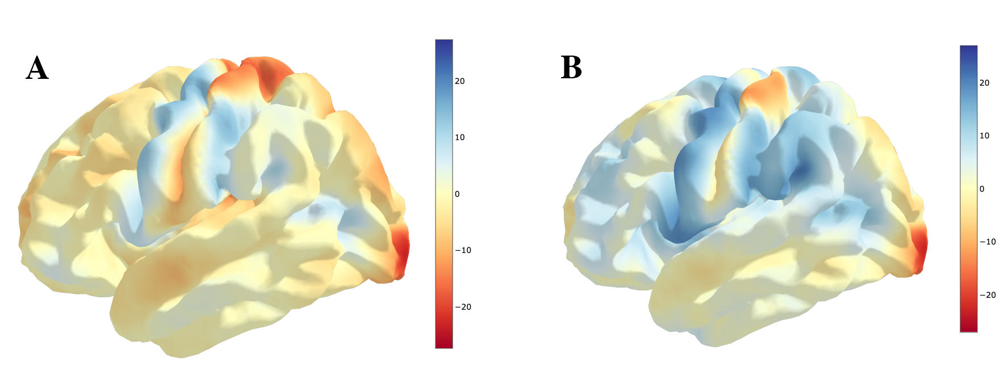

Similarity Based Functions
===========================

The PyReliMRI package that hsa several scripts that are in are interrelated in some ways.

The examples that follow will build on each script to make their use (hopeful) more clear. The scripts can \
be categories into two groups:

* Similarity: `similarity.py` & `tetrachoric_correlation.py`
* Intraclass Correlation: `icc.py` & `brain_icc.py`

As such, the two categories will be discuss together and build on each other in the next sections.

tetrachoric_correlation.py
--------------------------

similarity.py
-------------

**image_similarity**

As described previously, the purpose of the `similarity.py` is to calculate different types of similarity between \
two or more NifTi 3D images. These images can be from spm, fsl, afni or nilearn *preprocessed* output and the main requirement \
the user has to confirm two of the following are true:

* Image Shape: The two images being compared have to be of the same shape. If the images are of different length the the comparison of the volumes will be wrong. The package will throw an error if they are of the wrong shape.
* Normal/Coregistration: The images should be normalize in space for proper comparison. Here, you will not see an error but so ensure images are in the same space and properly aligned.

If you are unsure you can always load the images to compare or test it out and the function will give you an error.

.. code-block:: python

    from nilearn import image
    # checking image shape
    img1 = image.load_img("/path/dir/path_to_img.nii.gz")
    img1.shape

If your data does meet the requirements, you can easily use `image_similarity()`. The requirements for the function \
are:

* `imgfile1`: this is the string for the path to the first image (e.g., /path/dir/path_to_img1.nii.gz)
* `imgfile2` this is the string for the path to the first image (e.g., /path/dir/path_to_img2.nii.gz)
* `mask`: The mask is optional, but it is the path to the mask (e.g., /path/dir/path_to_img_mask.nii.gz)
* `thresh`: The threshold is option but highly recommended, the similarity between unthresholded images should usually be one (unless they were thresholded before). Base the threshold on your input image type. For example a beta.nii.gz/cope.nii.gz file would be thresholded using a different interger than zstat.nii.gz
* `similarity_type`: This the similarity calculation you want returned. The options are: 'dice', 'jaccard' or 'tetrachoric'

Let's say we want to fetch some data off of neurovault and calculate the similarity between two images. For this example \
we will use the `HCP task group activation maps <https://neurovault.org/collections/457/>`_. We will use nilearn to fetch these maps.

.. code-block:: python

    from nilearn.datasets import fetch_neurovault_ids
    # Fetch hand and foot left motor map IDs
    L_foot_map = fetch_neurovault_ids(image_ids=[3156])
    L_hand_map = fetch_neurovault_ids(image_ids=[3158])

We can look at the images to see the activation maps for each:

Now that we have pulled this data, we will load the similarity package from `imgreliability` and calculate the jaccard similarity coefficient  \
and tetrachoric correlation between the two images.

.. code-block:: python

    from imgreliability import similarity

    # calculate jaccard coefficient
    similarity.image_similarity(imgfile1=L_hand_map.images[0], imgfile2=L_foot_map.images[0], thresh = 1.5, similarity_type = 'jaccard')
    similarity.image_similarity(imgfile1=L_hand_map.images[0], imgfile2=L_foot_map.images[0], thresh = 1.5, similarity_type = 'tetrachoric')

The Jaccard coefficient is 0.18 and the Tetrachoric similarity is .776.

If we reduce the threshold to 1.0, in this instance the correlation will decrease and the Jaccard Coefficient will increase. \
Why? This is, in part, explained by the decreased overlapping zeros between the bianry images \
and the increased number of overlapping voxels in the Jaccard calculation.

**permute_images**

The `permute_images()` function is, for a lack of a better word, a wrapper over the `image_similarity()` function. It \
takes in similar values, except this time instead if `imgfile1` and `imgfile2` it's a list of paths to NifTi images. \
Otherwise, all of the same rules apply as described above. To review, the inputs to the `permute_images()` function are:

* `nii_filelist`: Which is a list of NII files, (e.g., ["/path/dir/path_to_img1.nii.gz", "/path/dir/path_to_img2.nii.gz", "/path/dir/path_to_img3.nii.gz")
* `mask`: The mask is optional, but it is the path to the mask (e.g., /path/dir/path_to_img_mask.nii.gz)
* `thresh`: The threshold is option but highly recommended, the similarity between unthresholded images should usually be one (unless they were thresholded before). Base the threshold on your input image type. For example a beta.nii.gz/cope.nii.gz file would be thresholded using a different interger than zstat.nii.gz
* `similarity_type`: This the similarity calculation you want returned. The options are: 'dice', 'jaccard' or 'tetrachoric'

Using the HCP example from above, let's pull add two more images into the mix. Let's be wild and add the RIGHT foot and hand images.

.. code-block:: python

    from nilearn.datasets import fetch_neurovault_ids
    # Fetch hand and foot left motor map IDs
    L_foot_map = fetch_neurovault_ids(image_ids=[3156])
    L_hand_map = fetch_neurovault_ids(image_ids=[3158])
    R_foot_map = fetch_neurovault_ids(image_ids=[3160])
    R_hand_map = fetch_neurovault_ids(image_ids=[3162])

We wont plot these images, but for reference we now have four image paths: `L_hand_map.images[0]`, `L_foot_map.images[0]`, \
`R_hand_map.images[0]`, `R_foot_map.images[0]`. Now we can try to run the `permute_images()` function:

.. code-block:: python

    # If you hadn't, import the package
    from imgreliability import similarity
    similarity.permute_images(nii_filelist=[L_foot_map.images[0],L_hand_map.images[0],
                              R_foot_map.images[0],R_hand_map.images[0]],thresh=1.5, similarity_type='jaccard')

As noted previously, the permutations are across the image combinations and return a pandas Dataframe. Such as.

+------+-----------------------+-------------------------------------------+
|      | similar_coef          | image_labels                              |
+======+=======================+===========================================+
| 0    | 0.18380588591461908   | image_3156.nii.gz ~ image_3158.nii.gz     |
+------+-----------------------+-------------------------------------------+
| 1    | 0.681449273874364     | image_3156.nii.gz ~ image_3160.nii.gz     |
+------+-----------------------+-------------------------------------------+
| 2    | 0.3912509226509201    | image_3156.nii.gz ~ image_3162.nii.gz     |
+------+-----------------------+-------------------------------------------+
| 3    | 0.18500433729643165   | image_3158.nii.gz ~ image_3160.nii.gz     |
+------+-----------------------+-------------------------------------------+
| 4    | 0.2340488091737724    | image_3158.nii.gz ~ image_3162.nii.gz     |
+------+-----------------------+-------------------------------------------+
| 5    | 0.41910546659304254   | image_3160.nii.gz ~ image_3162.nii.gz     |
+------+-----------------------+-------------------------------------------+
