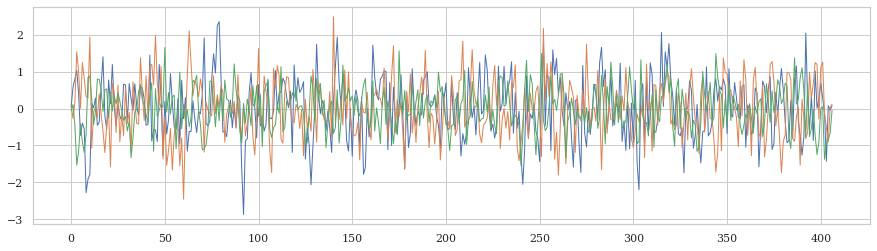
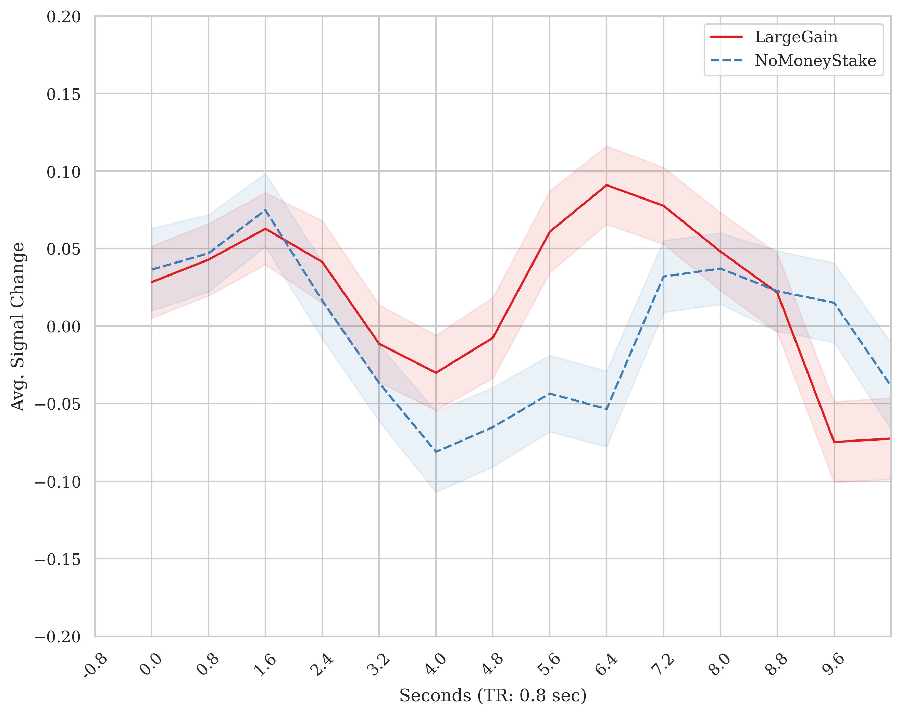
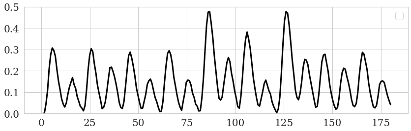
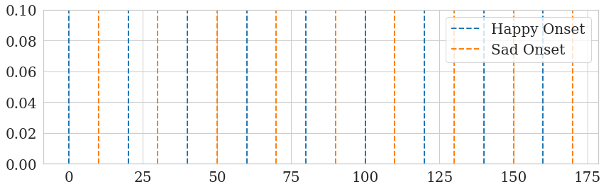
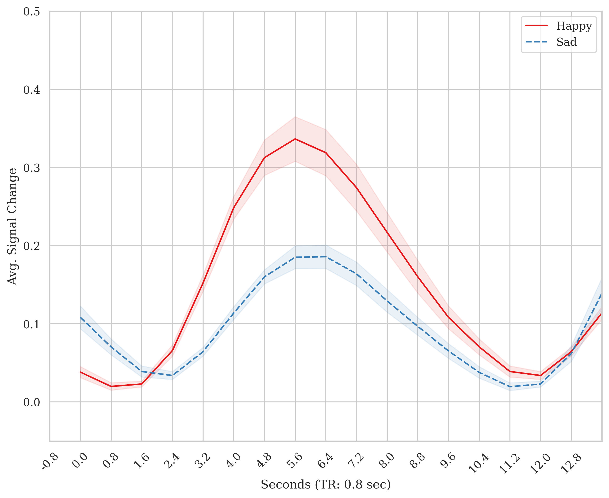

TR-by-TR Cue-locked Timeseries
================================

The `masked_timeseries` module extracts timeseries for region of interest (ROI) mask or ROI coordinates and generates TR-by-TR cue-locked timeseries. \
Below I cover three primary functions: extract_time_series extract_postcue_trs_for_conditions and plot_responses functions.
`extract_time_series` extracts the values from BOLD files, `extract_postcue_trs_for_conditions` aligns events timings to TRs ans generates TR-by-TR values \
and `plot_responses` uses the resulting values to generate a TR-by-TR figure.

**extract_time_series**

As mentioned above, the `extract_time_series` function extracts time series data from BOLD images for specified ROI or coordinates. \
This is achieve by either using NiftiLabelsMasker or nifti_spheres_masker from Nilearn to extract the timeseries and average the voxels within that ROI.

**extract_time_series**

As mentioned above, the `extract_time_series` function extracts time series data from BOLD images for specified regions of interest (ROI) or coordinates. The function uses either NiftiLabelsMasker or NiftiSpheresMasker from Nilearn to perform the extraction.

To use the `extract_time_series` function, you have to provide the following information:
    - bold_paths: A list of paths to the BOLD image files for each subject, run, and/or session.
    - roi_type: The type of ROI ('mask' or 'coords').
    - high_pass_sec: The high-pass filter cutoff in seconds (optional).
    - roi_mask: The path to the ROI mask file. If this is provided, the function will use NiftiLabelsMasker (required if roi_type is 'mask').
    - roi_coords: A tuple of coordinates (x, y, z) for the center of the sphere ROI (required if roi_type is 'coords').
    - radius_mm: The radius of the sphere in millimeters (required if roi_type is 'coords').
    - detrend: Whether to detrend the BOLD signal using Nilearn's detrend function (optional, default is False).
    - fwhm_smooth: The full-width at half-maximum (FWHM) value for Gaussian smoothing of the BOLD data (optional).
    - n_jobs: The number of CPUs to use for parallel processing (optional, default is 1). Depending on data size, at least 16GB per CPU is recommended.

The function returns:
    - If roi_type is 'mask':
        - List of numpy arrays containing the extracted time series data for each subject/run.
        - List of subject information strings formatted as 'sub-{sub_id}_run-{run_id}' reflecting the order of list of timeseries arrays.
    - If roi_type is 'coords':
        - List of numpy arrays containing the extracted time series data for each subject/run.
        - Nifti1Image coordinate mask that was used in the timeseries extraction.
        - List of subject information strings formatted as 'sub-{sub_id}_run-{run_id}' reflecting the order of list of timeseries arrays.

Utility
-------

Simply,  in fMRI, the goal is to fit a design matrix (comprised of task-relevant stimulus onsets & nuisance regressors), :math:`X\beta`, \
to timeseries data, :math:`Y`, for every given voxel or ROI. Plus some noise, :math:`\epsilon`. The model being:

.. math::

   Y = X \beta + \epsilon

A whole brain scan can can comprised of hundreds of thousands of voxels. However, we can use an ROI mask to get the average \
of voxels for a given mask for each volume (t). Any example of what that may look like from the AHRB study:

In the timeseries, there is a lot of variability. It is also harder to see meaningful fluctuations because we 1) can't easily see \
when events occur and 2) the change in amplitude is often very small. See discussions in `Drew (2019) <https://www.sciencedirect.com/science/article/pii/S0959438818302575>`_ \
and `Drew (2022) <https://www.sciencedirect.com/science/article/pii/S0166223622001618>`_. Nevertheless, by plotting the data \
for a given ROI/voxel, you can observe the change. Below is an example of how locked the onset of two cues, `LargeGain` and `NoMoneyStake` \
to the TRs from the timeseries from a modified version of the MID task, a change *may* be observed.

The purpose of the `masked_timeseries.py` module is to perform this sort of data extraction and plotting. Often, it is useful to \
dump out your timeseries signal to confirm that you are getting a response in visual and/or motor regions around the times they should occur. \
Second to the large effect regions, evaluating whether you are observed a response in a ROI specific to the process/stimulus of interest.

Example
-------

**dummy exampple**
Let's start off with a conceptual example. Say you have a time series for cue evoked response: Happy & Sad photos. You extract timeseries \
for a region that is more sensitive to `Happy` > `Sad` (whatever that may be...). In this region, these two cues would be differentiated by the signal. \
A prior, there is a thesis for how this may be. First, take a peak at the fake timeseries that includes both events.

It is a bit challenging to make out which even is where. Let's add sticks at which time the events occur.

Now, let's combine the two to see how the fake BOLD response is delayed after each cue but follows some ordered structure. \
The trend of the data becomes more apparent.

In this example, the the effect for `Happy` was intentionally made larger than `Sad`. So it is easier to visualize as it is made \
with Nilearn's SPM function (for code of this end-to-end example, see end of this doc). Nevertheless, we can extract the timeseries \
locked to these conditions to make it especially apparent:

**masked_timeseries example**
Now, I will review an example of how timeseries for an ROI can be extracted, locked to event files and plotted TR-by-TR using \
the `masked_timeseries.py` module.

.. code-block:: python

    from pyrelimri import masked_timeseries

    n3_boldpaths = ["./sub-1-ses-1_task-kewl_run-01_bold.nii.gz", "./sub-2-ses-1_task-kewl_run-01_bold.nii.gz", "./sub-3-ses-1_task-kewl_run-01_bold.nii.gz"]
    roi_mask_path = "./roi_mask.nii.gz"

    # mask versus coordinates example
    timeser_mask_n3, id_order = masked_timeseries.extract_time_series(bold_paths=n3_boldpaths, roi_type='mask',
                                                                      high_pass_sec=True, roi_mask=roi_mask_path,
                                                                      detrend=True, fwhm_smooth=4, n_jobs=2)
    # Extract timeseries using ROI coordinates with a radius of 6mm
    # coordinates
    coords = [(30, -22, -18), (50, 30, 40)]
    timeser_coord_n3, roi_sphere, id_order = masked_timeseries.extract_time_series(masked_timeseries.extract_time_series(bold_paths=n3_boldpaths,
                                                                                                                      roi_type='coords', high_pass_sec=True,
                                                                                                                      roi_coords=coords, radius_mm=6,
                                                                                                                   detrend=True, fwhm_smooth=4, n_jobs=2)

**extract_postcue_trs_for_conditions**

This function extracts the TR-by-TR cue-locked timeseries for different conditions at cue onset + TR delay.

To use the `extract_postcue_trs_for_conditions` function, you have to provide the following information:
    - events_data: A list of paths to the behavioral data files. This should match the order of subjects/runs/tasks as the BOLD file list.
    - onset: The name of the column containing onset values in the behavioral data.
    - trial_name: The name of the column containing condition values in the behavioral data.
    - bold_tr: The repetition time (TR) for the acquisition of BOLD data in seconds.
    - bold_vols: The number of volumes for BOLD acquisition.
    - time_series: The timeseries data extracted using the `extract_time_series` function.
    - conditions: A list of conditions to extract the post-cue timeseries for.
    - tr_delay: The number of TRs after onset of stimulus to extract and plot.
    - list_trpaths: The list of subject information strings formatted as 'sub-{sub_id}_run-{run_id}'.

The function returns a pandas DataFrame containing mean signal intensity values, subject labels, trial labels, TR values, and cue labels for all specified conditions.

Example:

.. code-block:: python

    from pyrelimri import masked_timeseries

    # Paths to events files
    events_data = ['/sub-1-ses-1_task-kewl_run-01_events.csv', './sub-2-ses-1_task-kewl_run-01_events.csv', './sub-3-ses-1_task-kewl_run-01_events.csv']

    # Onset column name
    onset = 'onset'

    # Trial type column name for onset timees and conditions, and list of conditions to plot
    trial_name = 'trial_type'
    conditions = ['Happy', 'Sad']

    # TR delay, 0 + delay to create
    tr_delay = 5

    # Extract post-cue timeseries for conditions. Notice, timeser_mask_n3 and id_order are from above example
    out_df = masked_timeseries.extract_postcue_trs_for_conditions(
        events_data=events_data, onset=onset, trial_name=trial_name, bold_tr=2.0, bold_vols=150,
        time_series=timeser_mask_n3, conditions=conditions, tr_delay=12, list_trpaths=id_order
    )

**plot_responses**

This function plots the average response for each condition using the post-cue timeseries.

To use the `plot_responses` function, you need to provide:
    - postcue_timeseries_dict: The dictionary with post-cue timeseries for each condition.
    - conditions: The list of conditions to plot.
    - output_file: The path to save the plot image.

The function does not return any value, but it saves the plot to the specified output file.

Example:

.. code-block:: python

    # Path to save the plot image
    output_file = "./responses_plot.png"

    # Plot average responses for conditions
    masked_timeseries.plot_responses(postcue_timeseries_dict=out_df, conditions=conditions, output_file=output_file)

This will generate and save a plot of the average response for each condition to the specified output file.

**Fake TR-by-TR code**

Defined a couple of functions. Some functions from `masked_timeseries.py` and some functions are based on Russ `Poldrack's MID simulations <https://github.com/poldrack/MID_simulations>`_

.. code-block:: python

    def extract_postcue_trs_for_conditions(events_data: list, onset: str, trial_name: str,
                                       bold_tr: float, bold_vols: int, time_series: np.ndarray,
                                       conditions: list, tr_delay: int, list_trpaths: list):

    dfs = []
    id_list = []
    # check array names first
    for beh_path in events_data:
        # create sub ID array to text again bold array
        beh_name = os.path.basename(beh_path)
        path_parts = beh_name.split('_')
        sub_id, run_id = None, None
        for val in path_parts:
            if 'sub-' in val:
                sub_id = val.split('-')[1]
            elif 'run-' in val:
                run_id = val.split('-')[1]
        sub_info = 'sub-' + sub_id + '_' + 'run-' + run_id
        id_list.append(sub_info)

    assert len(id_list) == len(list_trpaths), f"Length of behavioral files {len(id_list)} does not TR list {len(list_trpaths)}"
    assert (np.array(id_list) == np.array(list_trpaths)).all(), "Mismatch in order of IDs between Beh/BOLD"

    for cue in conditions:
        cue_dfs = [] # creating separate cue dfs to accomodate different number of trials for cue types
        sub_n = 0
        for index, beh_path in enumerate(events_data):
            subset_df = trlocked_events(events_path=beh_path, onsets_column=onset,
                                        trial_name=trial_name, bold_tr=bold_tr, bold_vols=bold_vols, separator='\t')
            trial_type = subset_df[subset_df[trial_name] == cue]
            out_trs_array = extract_time_series_values(behave_df=trial_type, time_series_array=time_series[index],
                                                       delay=tr_delay)
            sub_n = sub_n + 1  # subject is equated to every event file N, subj n = 1 to len(events_data)

            # nth trial, list of TRs
            for n_trial, trs in enumerate(out_trs_array):
                num_delay = len(trs)  # Number of TRs for the current trial
                if num_delay != tr_delay:
                    raise ValueError(f"Mismatch between tr_delay ({tr_delay}) and number of delay TRs ({num_delay})")

                reshaped_array = np.array(trs).reshape(-1, 1)
                df = pd.DataFrame(reshaped_array, columns=['Mean_Signal'])
                df['Subject'] = sub_n
                df['Trial'] = n_trial + 1
                tr_values = np.arange(1, tr_delay + 1)
                df['TR'] = tr_values
                cue_values = [cue] * num_delay
                df['Cue'] = cue_values
                cue_dfs.append(df)

        dfs.append(pd.concat(cue_dfs, ignore_index=True))

    return pd.concat(dfs, ignore_index=True)

    def plot_responses(df, tr: int, delay: int, style: str = 'white', save_path: str = None,
                       show_plot: bool = True, ylim: tuple = (-1, 1)):

        plt.figure(figsize=(10, 8), dpi=300)
        if style not in ['white', 'whitegrid']:
            raise ValueError("Style should be white or whitegrid, provided:", style)

        sns.set(style=style, font='DejaVu Serif')

        sns.lineplot(x="TR", y="Mean_Signal", hue="Cue", style="Cue", palette="Set1",
                     errorbar='se', err_style="band", err_kws={'alpha': 0.1}, n_boot=1000,
                     legend="brief", data=df)

        if plt_hrf in ['spm','glover']:
            if plt_hrf == 'spm':
                hrf = spm_hrf(tr=tr, oversampling=1, time_length=delay*2, onset=0)
                time_points = np.arange(1, delay + 1, 1)
                plt.plot(time_points, hrf, linewidth=2, linestyle='--',label='SPM HRF', color='black')
            if plt_hrf == 'glover':
                hrf = glover_hrf(tr=tr, oversampling=1, time_length=delay*2, onset=0)
                time_points = np.arange(1, delay + 1, 1)
                plt.plot(time_points, hrf, linewidth=2, linestyle='--',label='Glover HRF', color='black')

        # Set labels and title
        plt.xlabel(f'Seconds (TR: {tr} sec)')
        plt.ylabel('Avg. Signal Change')
        plt.ylim(ylim[0], ylim[1])
        plt.xlim(0, delay)
        plt.xticks(np.arange(0, delay, 1),
                   [f'{round((i * tr)-tr, 1)}' for i in range(0, delay)],
                   rotation=45)

        # Show legend
        plt.legend(loc='upper right')

        # Check if save_path is provided
        if save_path:
            # Get the directory path from save_path
            directory = os.path.dirname(save_path)
            # Check if directory exists, if not, create it
            if not os.path.exists(directory):
                os.makedirs(directory)
            # Save plot
            plt.savefig(save_path)

        # Show plot if show_plot is True
        if not show_plot:
            plt.close()

    def make_stick_function(onsets, durations, length=.1, resolution=.1):
    """
    Create a stick function with onsets and durations

    Parameters
    ----------
    onsets : list
        List of onset times
    durations : list
        List of duration times
    length : float
        Length of the stick function (in seconds)
    resolution : float
        Resolution of the stick function (in seconds)
        0.1 secs by default

    Returns
    -------
    sf : np.array
        Timepoints of the stick function
    """
    timepoints = np.arange(0, length, resolution)
    df = np.zeros_like(timepoints)
    for onset, duration in zip(onsets, durations):
        df[(timepoints >= onset) & (timepoints < onset + duration)] = 1
    sf_df = pd.DataFrame({'impulse': df})
    sf_df.index = timepoints
    return sf_df

    def generate_data(desmtx_conv, beta_dict, noise_sd=.005, beta_sub_sd=.005):
        """
        Generate data based on the design matrix and beta values

        Parameters
        ----------

        desmtx_conv : pd.DataFrame
            Design matrix with convolved regressors
        beta_dict : dict
            Dictionary of beta values for each regressor of interest
        noise_sd : float
            Standard deviation of the noise
        beta_sub_sd : float
            Standard deviation of the betas across subjects
        """
        # check the beta dict
        betas = np.zeros(desmtx_conv.shape[1])
        for key in beta_dict.keys():
            assert key in desmtx_conv.columns, f'{key} not in desmtx'
        betas = np.array([beta_dict[key] if key in beta_dict.keys() else 0 for key in desmtx_conv.columns ], dtype='float32')
        if beta_sub_sd > 0:
            betas += np.random.normal(0, beta_sub_sd, betas.shape)

        data = np.dot(desmtx_conv.values, betas) + np.random.normal(0, noise_sd, desmtx_conv.shape[0])
        data_df = pd.DataFrame({'data': data})
        data_df.index = desmtx_conv.index
        return data_df

    def create_conv_mat(eventsdf, tr_dur=None, acq_dur=None):
        vol_time = acq_dur
        tr = tr_dur
        design_mat = make_first_level_design_matrix(
            frame_times=np.linspace(0, vol_time, int(vol_time/tr)),
            events=eventsdf, hrf_model='spm',
            drift_model=None, high_pass=None)
        return design_mat

Create a fake events file, convolve them using Nilearn's function and generate a timeseries.

.. code-block:: python

    task_time = 180
    onsets = np.arange(0, task_time, 10)

    np.random.seed(11)
    dur_opts = [1.5, 2, 2.5]
    prob_durs = [.50, .25, .25]
    durations = np.random.choice(dur_opts, size=len(onsets), p=prob_durs)

    trial_types = ["Happy" if i % 2 == 0 else "Sad" for i in range(len(onsets))]

    events_df = pd.DataFrame({
        "onset": onsets,
        "duration": durations,
        "trial_type": trial_types
    })

    conv_vals = create_conv_mat(eventsdf=events_df, tr_dur=tr, acq_dur=task_time)

    beta_dict = {'Happy': 1, 'Sad': .6}
    data_fake = generate_data(conv_vals[['Happy','Sad']], beta_dict)

Plot the 1) fake timeseries and 2) timeseries and events combined

.. code-block:: python

    plt.figure(figsize=(14, 4))
    plt.plot(data_fake, color='black', linewidth=3)
    plt.ylim(0,.5)
    plt.xticks(fontsize=20)
    plt.yticks(fontsize=20)
    plt.legend(fontsize=20)

.. code-block:: python

    plt.figure(figsize=(14, 4))
    plt.plot(data_fake, color='black')
    # sticks at each onset
    for onset in events_df[events_df['trial_type'] == 'Happy']['onset']:
        plt.vlines(onset, ymin=0, ymax=conv_vals.values.max(), color='#1f77b4', linestyle='--',
                   linewidth=3, label='MakinIt ~ 1')

    for onset in events_df[events_df['trial_type'] == 'Sad']['onset']:
        plt.vlines(onset, ymin=0, ymax=conv_vals.values.max(), color='#ff7f0e', linestyle='--',
                   linewidth=3, label='FakinIt ~ .6')

    # only getting main legends
    handles, labels = plt.gca().get_legend_handles_labels()
    by_label = dict(zip(labels, handles))
    plt.legend(by_label.values(), by_label.keys(), fontsize=20)
    plt.ylim(0,.5)
    plt.xticks(fontsize=20)
    plt.yticks(fontsize=20)

    plt.show()

First, reshape file from volumes (225, 1) --> into the shape that is expected: number of subjects, volumes, 1 (1, 225, 1). \
Save the fake events file path for this one fake subject and use it in the function from `masked_timeseries.py`.

.. code-block:: python

    timeseries_reshaped = np.reshape(data_fake, (1, len(data_fake), 1))
    events_df.to_csv('/tmp/sub-01_run-01_test-events.csv',sep = '\t')
    events_file = ['/tmp/sub-01_run-01_test-events.csv']

    events_file = ['/tmp/sub-01_run-01_test-events.csv']
    conditions=['Happy','Sad']
    trdelay=int(15/tr)
    df = extract_postcue_trs_for_conditions(events_data=events_file, onset='onset', trial_name='trial_type',
                                           bold_tr=tr, bold_vols=len(timeseries_reshaped[0]), time_series=timeseries_reshaped,
                                           conditions=conditions, tr_delay=trdelay,list_trpaths=['sub-01_run-01'])
    plot_responses(df=df,tr=tr, delay=trdelay, save_path=None,style='whitegrid',
                       show_plot=True, ylim=(-.05, .5))
