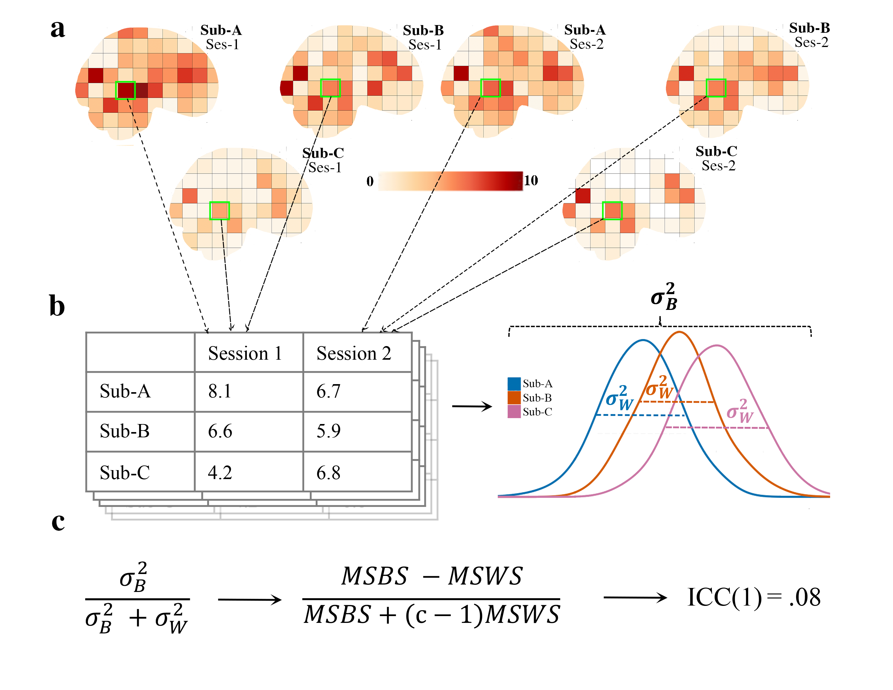
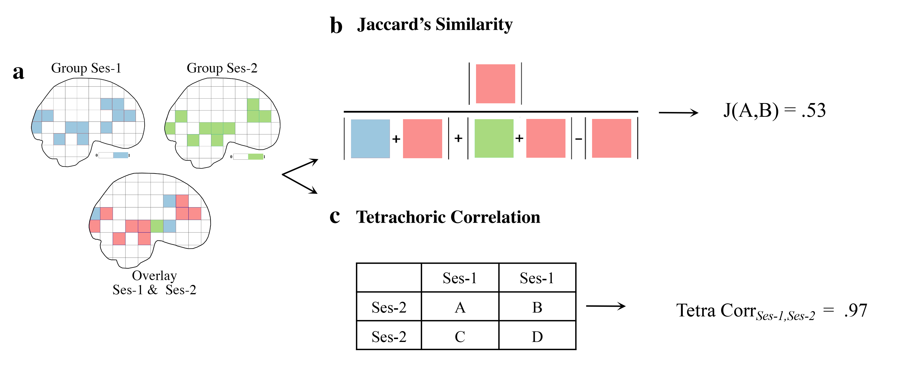

pyrelimri
=========

The `pyrelimri` package contains multiple modules for calculating image reliability measures.

brain_icc
---------

From `pyrelimri` the `brain_icc` module contains the following function:

* `brain_icc.voxelwise_icc(paths_sess1, paths_sess2, mask, paths_sess3 = None, icc_type = 'icc_3')`: As show in Figure 1, calculates the intraclass correlation (e.g., ICC(1), ICC(2,1), or ICC(3,1)) for 3D volumes across 1+ sessions, returning five 3D volumes reflecting the ICC estimate, the 95% lowerbound for ICC estimate, 95% upperbound for ICC estimate, mean squared error between subjects, mean squared error within subjects.

Inputs:

  * REQUIRED: Paths to 3D Nifti, session 1: string; Paths to 3D Nifti, session 2: string, brain mask: string
  * OPTIONAL: Paths to 3D Nifti , session 3: string; ICC type, icc = string (default = ‘icc_3’, options include: ‘icc_3’,’icc_2’,’icc_1’)

   Figure 1. Voxelwise intraclass correlation

icc
---

From `pyrelimri` the `icc` module contains the following functions:

* `icc.sumsq_total(df_long, values)`: Calculates to total sum of squared error between subjects & sessions.

* `icc.sumsq_within(df_long, sessions, values, n_subjects)`: Calculates the sum of squared error within subjects across sessions

* `icc.sumsq_btwn(df_long, subj, values, n_sessions)`: Calculates the sum of squared error between subjects

* `icc.icc_confint(msbs, msws, mserr, msc, n_subjs, n_sess, icc_2 = None, alpha = 0.05, icc_type = 'icc_3')`: Calculates the 95% confidence interval (default) using f-statistic

* `icc.sumsq_icc(df_long, sub_var, sess_var, value_var, icc_type = 'icc_3')`: Calculates the total, within, between error and returns ICC estimate (e.g., ICC(1), ICC(2,1), or ICC(3,1)) with associated 95% lowerbound and 95% upperbound for ICC, mean between subject variance and mean within-subject variance.

Inputs:
  * REQUIRED: Panda long dataframe with: subject variable, sub_var: string; session variable, sess_var: string; the scores, value_var: string;
  * OPTIONAL: the icc type for `sumsq_icc()` & `icc_confint()`, icc_type: string (default = 'icc_3', options: 'icc_3', 'icc_2', 'icc_1')

similarity
----------

from `pyrelimri` the `similarity` module contains the following functions:

* `similarity.image_similarity(imgfile1, imgfile2, mask = None, thresh = None, similarity_type = 'dice')`: Calculates the similarity between two images. For example, in Figure 1a a measure 1 nifti img1 (thresholded p < 001, blue) and img2 (thresholded p <001, green). The overlapping thresholded voxels are in red. By requesting the Jaccard similarity coefficient (Fig1b), you will get a index of similarity between these two nifti images. Alternatively, you may ask what is the similarity using a binary correlation. Using tetrachoric correlation (Fig1c) we can get the similarity between voxels that are above the p < .001 threshold (==1) and those below (==0) between the two images.

* `similarity.pairwise_similarity(nii_filelist, mask = None, thresh = None, similarity_type = 'dice')`: Calculates the similarity between two images. Permute across 2+ images to calculate similarity coefficient between all possible image pairs.

Inputs:
  * REQUIRED: Path to 3D Nifti, imgfile1: string; Path to 3D Nifti, imgfile2: string; 3D Nifti list, nii_filelist: string
  * OPTIONAL: Path to a mask: string; threshold on images, thresh: float; similarity type betwee images, similarity_type: string (default = ‘dice’, options include: ‘dice’, ‘jaccard’, ‘tetrachoric’)

   Figure 2. Similarity Between Images

tetrachoric_correlation
-----------------------

From `pyrelimri` the `tetrachoric_correlation` module contains the following function:

* `tetrachoric_correlation.tetrachoric_corr(vec1, vec2)`: Calculates the tetrachoric correlation between two binary vectors.

Inputs:
  * REQUIRED: Binary vector1, vec1: NDarray; Binary vector2, vec2: NDarray

