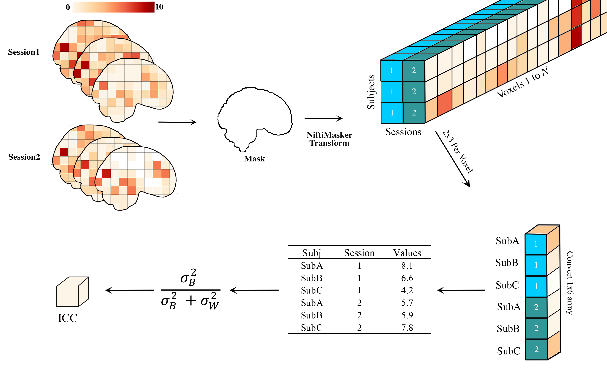
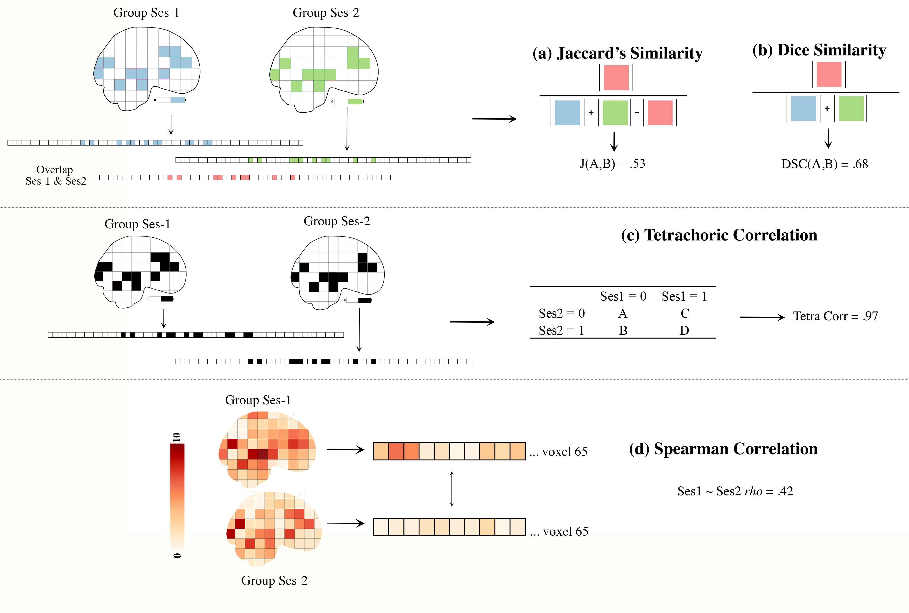
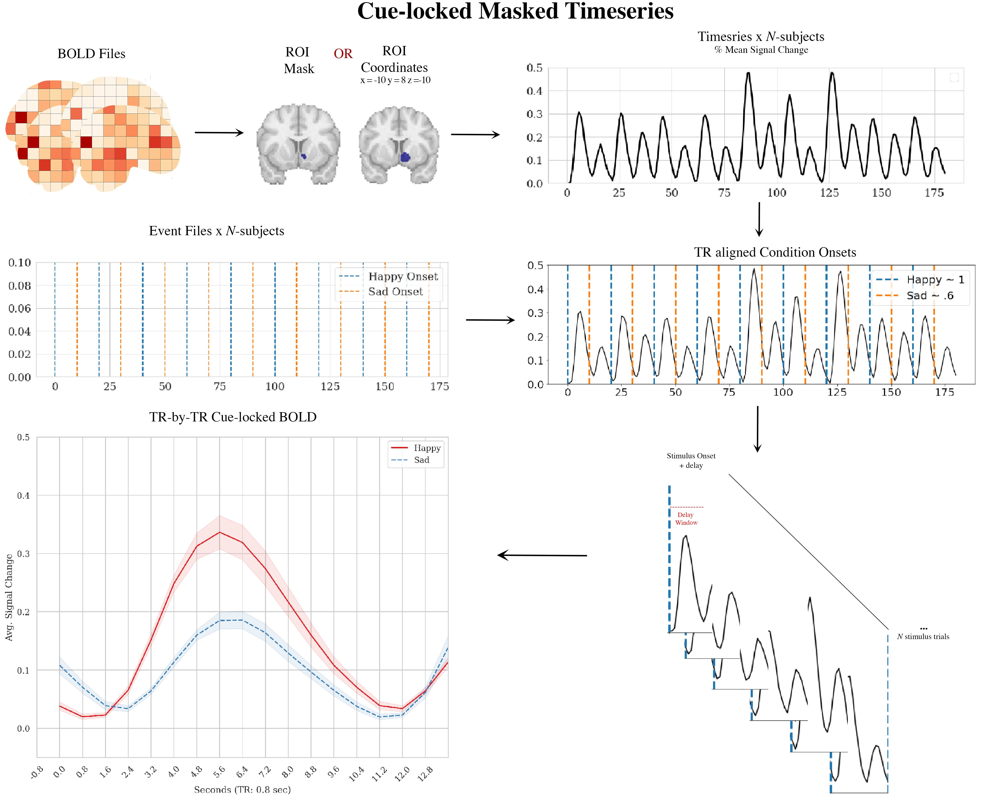

===============
PyReliMRI Usage
===============

The `pyrelimri` package contains multiple modules for calculating image reliability measures.

brain_icc
---------

From `pyrelimri`, the `brain_icc` module contains functions for voxelwise and atlas-based intraclass correlation estimates on 3D volumes.

voxelwise_icc
~~~~~~~~~~~~~

.. autofunction:: pyrelimri.brain_icc.voxelwise_icc

roi_icc
~~~~~~~

.. autofunction:: pyrelimri.brain_icc.roi_icc

   Figure 1. Voxelwise Intraclass Correlation

icc
---

From `pyrelimri`, the `icc` module contains various functions related to intraclass correlation coefficient calculations.

sumsq_total
~~~~~~~~~~~

.. autofunction:: pyrelimri.icc.sumsq_total

sumsq_within
~~~~~~~~~~~~

.. autofunction:: pyrelimri.icc.sumsq_within

sumsq_btwn
~~~~~~~~~~

.. autofunction:: pyrelimri.icc.sumsq_btwn

icc_confint
~~~~~~~~~~~

.. autofunction:: pyrelimri.icc.icc_confint

sumsq_icc
~~~~~~~~~

.. autofunction:: pyrelimri.icc.sumsq_icc

similarity
----------

From `pyrelimri`, the `similarity` module contains functions to calculate image similarity coefficients.

image_similarity
~~~~~~~~~~~~~~~~

.. autofunction:: pyrelimri.similarity.image_similarity

pairwise_similarity
~~~~~~~~~~~~~~~~~~~

.. autofunction:: pyrelimri.similarity.pairwise_similarity

   Figure 3. Similarity Between Images

tetrachoric_correlation
-----------------------

From `pyrelimri`, the `tetrachoric_correlation` module contains functions to calculate tetrachoric correlation between binary images.

tetrachoric_corr
~~~~~~~~~~~~~~~~

.. autofunction:: pyrelimri.tetrachoric_correlation.tetrachoric_corr

conn_icc
--------

The `conn_icc` module is a wrapper for the `icc` module, specifically focusing on edge-wise intraclass correlation coefficient calculations.

edgewise_icc
~~~~~~~~~~~~

.. autofunction:: pyrelimri.conn_icc.edgewise_icc

masked_timeseries
=================

The `masked_timeseries` module extracts timeseries data from BOLD images for regions of interest (ROI).

   Figure 4. Masked Timeseries Illustration

extract_time_series
~~~~~~~~~~~~~~~~~~~

.. autofunction:: pyrelimri.masked_timeseries.extract_time_series

extract_postcue_trs_for_conditions
~~~~~~~~~~~~~~~~~~~~~~~~~~~~~~~~~~

.. autofunction:: pyrelimri.masked_timeseries.extract_postcue_trs_for_conditions

plot_responses
~~~~~~~~~~~~~~

.. autofunction:: pyrelimri.masked_timeseries.plot_responses
